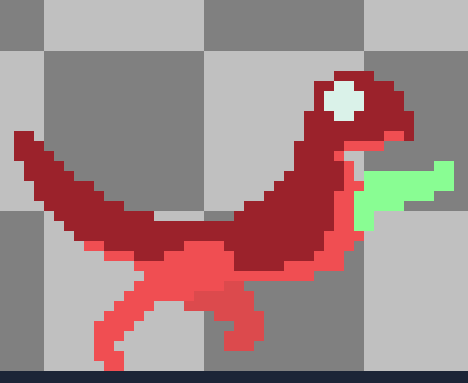

<!--
**Way2Farr/Way2Farr** is a ✨ _special_ ✨ repository because its `README.md` (this file) appears on your GitHub profile.

Here are some ideas to get you started:

- 🔭 I’m currently working on ...
- 🌱 I’m currently learning ...
- 👯 I’m looking to collaborate on ...
- 🤔 I’m looking for help with ...
- 💬 Ask me about ...
- 📫 How to reach me: ...
- 😄 Pronouns: ...
- ⚡ Fun fact: ...
-->

# Hi there! I'm Nathan Gozun
## About me:

- 🔭 I’m currently working on [Velocigrappler](https://github.com/Way2Farr/velociGUN.git)

- 😄 Fun Project that I worked with others on [ParadigmShift](https://github.com/Way2Farr/Paradigm-ShiftGame)

- 🌱 I’m currently learning Game and Web Development

- 🤔 I am currently a fourth year at SDSU

## Languages and Tools:

  
  
  
  
  
  
  
   
  

## Stats

&nbsp;

